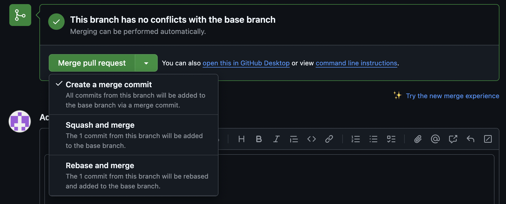

# Branch Github

c koi ? a koi sa sert ?

l'idée c'est de simplifier et vous aidez dans votre travail de groupe.

### SI VOUS AVAIS UNE QUESTION DEMANDER MOI (TOM) DIRECTEMENT ! JE RESTE AUSSI DISPO PAR MESSAGE SI VOUS ME TROUVEZ PAS A EPITECH OU QUE VOUS FAITES CETTE FORMATION LE WEEK-END

# Etape 1 :

### Crée une branch github :

# Formation Github

## Bienvenue dans cette micro formation

# Etape 1 :

### Crée une branch github :

Première étape c'est de m'assurer que je suis à jour avec la branch **_MAIN_** 
`git pull`
une fois à jour je crée ma branch :  
`git checkout origin/main -b [nom de ma branch]` ou alors `git checkout -b nomdebranch main` ou alors `git switch -c nomdebranch main`  

# Etape 2

### Ajouté un fichier

Je crée un fichier à la racine du projet, le fichier doit avoir pour nom votre prénom. Et dedans vous ajouté une petite ligne histoire d'avoir du contenu dans le fichier.  

#### Une fois le fichier ajouté :

`git add [nom du fichier]`

`git commit -m "[nom de commmit precis & en anglais]"``

# Etape 3

### Push mon fichier

Une fois commit je pousse mes modifications sur mon repo distant :  
`git push origin -u [nom de ma branch]`  
 
le **_origin -u [nom de ma branch]_** est obligatoire lorsque la branch n'existe pas sur mon repo distant. Dans le cas ou il est existant sur mon repo distant je peut juste `git push`

# Etape 4

### création de la Pull request

Je me rend [ici](https://github.com/TPilate/FormationGithub) et je devrais voir :
  
**Cliqué** sur _Compare & pull request_

### Comment remplir ma pull request ?

Vous avais plusieurs choses à vérifier la premiere c'est vers quel branch souhaitez vous envoyé vos modifications ?  

#### Choix du point de réceptions des modifications

Si vous souhaitez envoyé vos modifications ils vous faut sélectionner **Main**
dans notre cas je vais vous demander de séléctionner : **branchTest**  
_Vous devrez donc avoir ce résultat :_
  

#### Description

Ensuite vous devais ajouté une description, en entreprise vous serez amené à travailler via des _tickets_ et en général vous pouvais mettre le lien du ticket en description.  
Ici je vais vous demander d'ajouté une simple description avec votre prénom et ce que vous venais de faire.  
_exemple :_ Toto, ajout d'un fichier toto.txt

#### Crée ma pull request

Ensuite vous cliqué simplement sur **_create pull request_**

# Etape 5

### Demandé une review

Vous allez maintenant demandé une review vous pouvez procéder de plusieurs maniere la premiere via github :

En ajoutant l'identifiant github de la personne dont vous souhaitez avoir une review  
la 2nd maniere c'est juste en envoyant à la personne le liens de votre PR.  
Vous allez demandé à la personne assises a votre droite de validé votre PR.

# Etape 6

### Merge ma pull request

Une fois que j'ai ma review je merge ma pull request :

Vous avais ici 3 options :

- Create a merge commit
  qui va juste incrémenter les commits de votre PR à la branch sélectionner
- Squash and merge
  qui va crée **_UN_** commit regroupant vos commits et ensuite intégrer ce commit a la branch séléctionner
- Rebase and merge
  Elle applique les commits comme s'ils avaient toujours été faits directement sur la branche cible, rendant l'historique plus simple à lire.

Par experience je n'ai jamais utiliser le **_Rebase and merge_** et dans notre cas nous avons uniquement 1 commit donc choisissez l'option **_Create a merge commit_**

##### dans le cas ou vous avais plusieurs commit le Squash and merge est mieux !!
