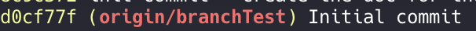

# Cherry Pick

keske c ? a koi sa sert ?

l'idée est dans le nom, cela vous permet de récuperer un commit précis et de l'intégrer a votre branch.

# Etape 1

mettre a jour la branch main

# Etape 2

Crée une nouvelle branch vous pouvais vous réferer à cette [doc](./branch.md) pour crée votre branch. (soyez bien à jour avec main avant de crée votre nouvelle branch)

# Etape 3

Récuperer le commit de la branch nommée : **_cherryPickBranch_**

### Comment récuperer un commit ?

Premiere choses identifié le commit et son SHA, vous avais plusieurs façon :

- allez sur la branch qui contient le commit qui vous intéresse puis faite `git log`
  Une interface va s'ouvrir avec beaucoup d'informations celle qui vous intéresse est préceder par le mot **_commit_**
    
  en fonction de votre terminal vous aurais même une indications sur la branch d'origin de ce commit.
- vous avais aussi l'option `git log --oneline` qui elle vous permet d'avoir juste des infos précise :
    
- Ou vous pouvez allez sur github, séléctionner la branch qui vous intéresse et regarder la liste des commits.

dans tout les cas ils vous faut le sha du commit, celui ci peut etre entier ou non exemple :

- option longue : d0cf77fa2ab6206e21d0450b7f36d08ffa752d81
- option courte : d0cf77f

### Une fois le SHA récuperer

Je me positionne sur la branch que je viens de crée et je fait la commande :
`git cherry-pick [sha du commit a pick]` 
Vous devriez maintenant voir un nouveau fichier nommé TOTO.txt cela signifie donc que votre cherry-pick c'est fait sans probleme.
